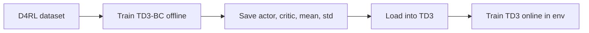

# TD3-BC → TD3 Transfer Pipeline

**Goal:** Offline pretrain with TD3-BC on D4RL → transfer actor/critic weights to TD3 → train TD3 online. Simple and working. No policy refinement, no α decay, no stability focus.

---

## 1. Pipeline overview




- **Stage 1 (offline):** Train TD3-BC on fixed D4RL data (existing [TD3_BC.py](TD3_BC.py) and [main.py](main.py) logic). Save: actor state_dict, critic state_dict, normalization (mean, std), env name.
- **Stage 2 (online):** Build vanilla TD3 with same architecture, load saved actor/critic weights and normalization. Interact with env (with exploration noise), fill replay buffer, train TD3 (no BC term). Eval periodically.

---

## 2. Code changes

**2.1 Use vanilla TD3 from [TD3/](TD3/) folder**  
Use the existing [TD3/TD3.py](TD3/TD3.py) implementation. Its Actor and Critic have the same architecture (256–256, same layer names) and the same save/load format (`filename_actor`, `filename_critic`, etc.) as [TD3_BC.py](TD3_BC.py), so a checkpoint saved by TD3-BC loads directly into `TD3.TD3`. No new TD3 class or copy; `train_online.py` will import and use `TD3.TD3` from the TD3 folder. Ensure the project can import it (e.g. run from repo root and `from TD3 import TD3` or add `TD3` to `sys.path` and `import TD3` then `TD3.TD3`).

**2.2 train_offline.py**  

- Args: `--env` (e.g. `halfcheetah-medium-v2`), `--seed`, `--max_timesteps` (default 1e6), `--save_dir` (default `./models`), `--eval_freq`, `--save_model`.
- Same as current [main.py](main.py) flow: load D4RL dataset → ReplayBuffer, normalize states, train TD3-BC, eval every `eval_freq`.
- Save: `actor`, `critic` (and optionally optimizers), `normalization.npz` (mean, std), and e.g. `metadata.json` or a small file with `env` name so online script knows which env to create.

**2.3 train_online.py**  

- Import **TD3 from the [TD3/](TD3/) folder** (e.g. `from TD3.TD3 import TD3` or add TD3 to path and `import TD3` then `TD3.TD3`). Build TD3 agent with env’s state_dim, action_dim, max_action (same kwargs as [TD3/main.py](TD3/main.py): discount, tau, policy_noise, noise_clip, policy_freq).
- Args: `--checkpoint_dir` (path to folder with saved `*_actor`, `*_critic` and `normalization.npz`), `--env`, `--seed`, `--max_timesteps`, `--expl_noise`, `--eval_freq`, `--save_dir`.
- Load checkpoint: `policy.load(checkpoint_path)` (same file naming as TD3_BC/TD3). Load mean, std from `normalization.npz` for state normalization.
- **State normalization:** The offline policy was trained on normalized states. When acting and when storing transitions, normalize state and next_state with the saved mean/std so the loaded TD3 receives the same input distribution. Use root [utils.py](utils.py) ReplayBuffer (has `add`); normalize before `replay_buffer.add(norm_s, a, norm_s_next, r, done)` and use normalized state for `policy.select_action`.
- Loop: same as [TD3/main.py](TD3/main.py) — act with π(s) + exploration noise, add to buffer, train. Optionally skip or shorten the initial random exploration (`start_timesteps`) since the policy is already pretrained. Eval every `eval_freq` (normalize eval state with mean, std); report return and, if D4RL env, normalized score.
- Save final model and optionally a simple metrics log (step, eval return).

---

## 3. Project layout

```
TD3_BC/
  TD3_BC.py        # existing (offline TD3-BC only)
  utils.py         # ReplayBuffer + convert_D4RL (unchanged)
  main.py          # keep as-is (original offline-only entrypoint)
  train_offline.py # D4RL → TD3-BC → save checkpoint + normalization
  train_online.py  # load into TD3 from TD3/ → train online with normalization
  TD3/             # vanilla TD3 (use as-is: TD3.TD3, TD3.utils)
  results/         # optional eval logs
  models/          # checkpoints (actor, critic, normalization.npz)
  requirements.txt
```

---

## 4. Implementation order

1. **train_offline.py:** Use existing [TD3_BC.py](TD3_BC.py) and [main.py](main.py) logic: load D4RL dataset, normalize states, train TD3-BC, eval periodically. Save checkpoint with same naming as TD3 (e.g. `{save_dir}/{file_name}_actor`, `_critic`) and `normalization.npz` (mean, std), plus env name (e.g. in metadata or as a convention).
2. **train_online.py:** Import **TD3 from [TD3/TD3.py](TD3/TD3.py)**. Load checkpoint into `TD3.TD3`, load normalization. Run online loop with normalized states (normalize before `select_action` and before adding to buffer). Use root `utils.ReplayBuffer` for the online buffer. Eval with normalized state; optionally report D4RL normalized score if D4RL env.
3. **requirements.txt** and README: list deps and two-command run (offline then online). Note that TD3 folder is used as the vanilla online agent.

**End-to-end test:** Run offline for 100k steps on `halfcheetah-medium-v2`, then online for 50k steps; confirm no crashes and eval score is logged.